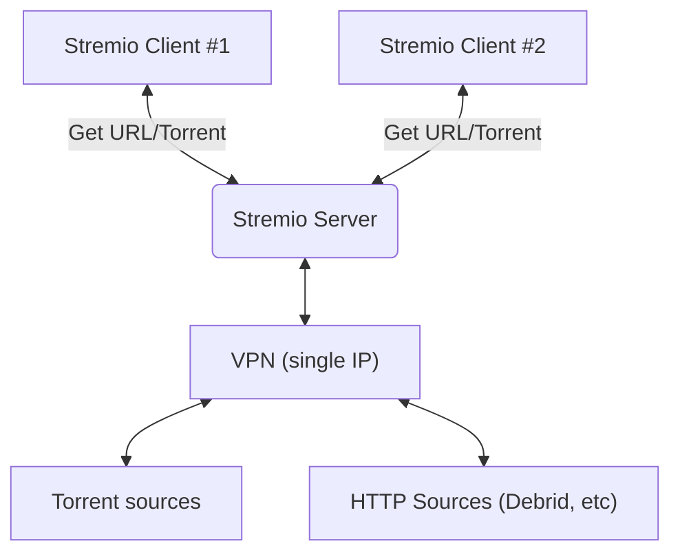

## FAQ 

### How does it work?

Here's a rough diagram illustrating the process. The server will transcode **any** media, even if that "transcode" is simply the a "copy" of the original media (because the client is able to play the media without alteration)

### Why do I need a VPN?

The Stremio Server is capable of downloading torrents, and interacting with your private media / debrid providers on your behalf (*which may have source IP address limitations*). To this end, you need to bring your own (BYO) VPN in order to use Stremio Server on ElfHosted. We support any VPN provider supported by [gluetun](https://github.com/qdm12/gluetun), and provider-specific configuration is collected when you subscribe to the appropriate product from the store.

### How do I know it's working?

Depending on your Stremio Client, if the Stremio Server fails, the client may play the media directly without the server.

You can use [Kubernetes Dashboard][kubernetes-dashboard] to examine the pod logs, and confirm that a stream is correctly transcoding.

Stremio Server won't start without a connected VPN, so if troubleshooting, examine the `gluetun` container logs in the pod, and confirm that your VPN isn't erroring.

### How many concurrent streams can I play?

Currently, the concurrency is limited to 2 transcodes, and 100Mbps total throughput. Following initial user testing / feedback, we may roll out further "plus" subscriptions with higher limits.

### Client compatibility

Testing has shown that not all Stremio clients support transcoding HTTP (Debrid) streams via Stremio Server. In the case of these clients, the client will simply stream the content directly, without transcoding / proxying. The difference seems to be between v4 and v5 of the client, and as further information is discovered, it'll be added below:

Client | Version | Torrents | Debrid | Tested On
---------|---------|----------|---------|--------
https://web.strem.io | 5.0.0-beta8 | :white_check_mark: | :white_check_mark: | 9 Apr 2024
ElfHosted [Flixio][flixio] | 5.0.0-beta8 |:white_check_mark: | :white_check_mark: | 9 Apr 2024
https://app.strem.io | 4.4.167 | :white_check_mark: | :x: | 9 Apr 2024
OSX Desktop | 4.4.168 | :white_check_mark: | :x: | 9 Apr 2024
nVidia Shield | TBC (latest?) | :white_check_mark: | :x: | 9 Apr 2024 