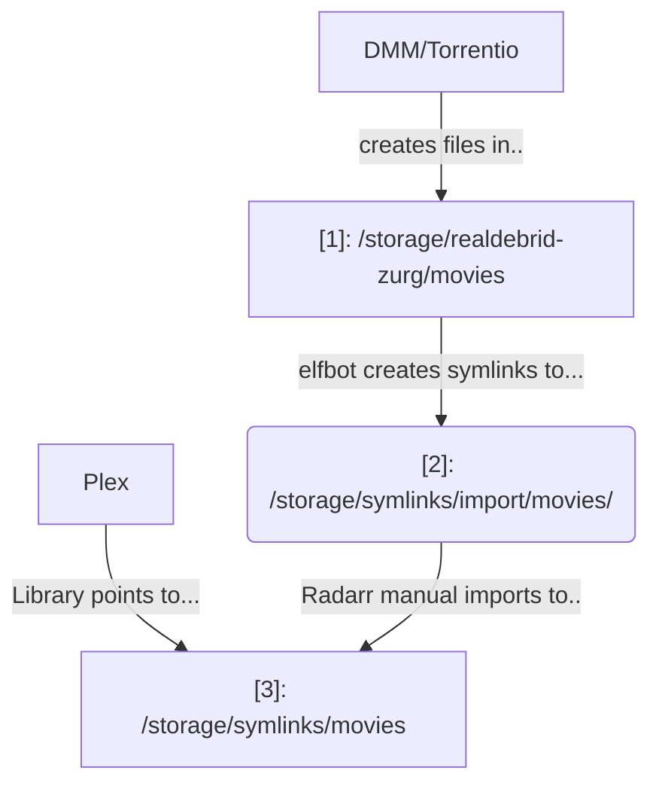

# {{ page.meta.slug }}

Radarr is a movie collection manager for Usenet and BitTorrent users. It can monitor multiple RSS feeds for new movies and will interface with clients and indexers to grab, sort, and rename them.

It can also be configured to automatically upgrade the quality of existing files in the library when a better quality format becomes available.




## Import existing remote media

If you have existing remote media mounted at `/storage/<something>` (*like Real-Debrid*), you can [use ElfBot to create symlinks](/app/elfbot#how-to-import-symlinks) to bring this into your Radarr library, without consuming any more space.

Here's how the process works. The end result is that Plex only sees `[3]: /storage/symlinks/movies`:

To perform a symlink import using [ElfBot][elfbot], run `elfbot symlink /storage/realdebrid-zurg/movies`. ElfBot will symlink any **new**  content at `/storage/realdebrid-zurg/movies` to `/storage/symlinks/import/movies`. After this, use Radarr to perform an automatic / interactive manual import from `/storage/symlinks/import/movies/`.

In Radarr, use `Movies` -> `Manual Import`, and point the import at `/storage/symlinks/import/movies/`, as illustrated below:

!!! warning "Not Library Import"
    We're not importing an organized library here, we're importing a messy bunch of files created by DMM / Stremio. Use `Movies` -> `Manual Import` instead, since this will rename and upgrade your content, and move it to existing libraries

## HD and 4K Libraries

Radarr isn't able to keep multiple copies of the same movie in different formats - it tries to upgrade a lower-quality format when a higher-quality one becomes available. It's sometimes desirable to keep multiple versions in your storage though, so that [Plex][plex] / [Jellyfin][jellyfin] / [Emby][emby] can prompt you which version you'd like to play.

To this end, a "4K" version of Radarr is available, which can either be manually managed, or configured to sync with the "regular" (HD) Radarr.

