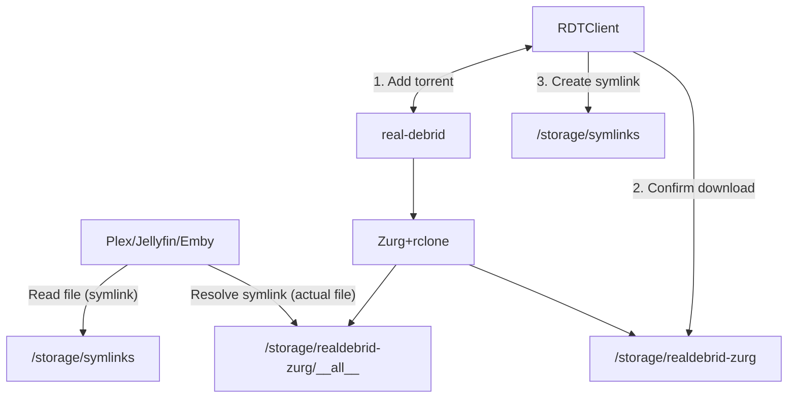

# {{ page.meta.slug }}

RDT Client a web interface to manage your torrents on [Real-Debrid](https://real-debrid.com/?id=1348683), [AllDebrid](https://alldebrid.com/?uid=2v91l) or [Premiumize](https://www.premiumize.me/).

It supports the following features:

* [x] Add new torrents through magnets or files
* [x] Download all files from Real-Debrid, AllDebrid or Premiumize to your local machine automatically
* [x] "Symlink Downloader", which works with [Zurg][zung] to make remote content **appear** to be stored locally, so that it can be managed / renamed by [Radarr][radarr] and [Sonarr][sonarr]
* [x] Unpack all files when finished downloading
* [x] Implements a fake qBittorrent API so you can hook up other applications like Sonarr, Radarr or Couchpotato.




## Set your download directory

The app defaults to saving to `/data/downloads` - this will fail, and needs to be changed to your desired `/storage/<whatever>` mount.

## Symlink Downloader

A popular configuration for RDTClient is to use the "Symlink Downloader". It works like this:

1. A torrent is added to RDTClient, which submits it to [Real-Debrid][real-debrid] to be downloaded
2. Zurg is running, configured with an rclone mounts, so that `/storage/realdebrid-zurg/__all__` shows all files in the user's Real-Debrid account, **for all apps**
3. RDTClient confirms that the download is "completed" (*expected files exist in `/storage/realdebrid-zurg/__all__`*), and creates a **symlink** from `/storage/realdebrid-zurg/__all__/<filename>` to `/storage/symlinks/downloads/complete/[radarr/sonarr]/<filename>.`
4. Now, Radarr / Sonarr can rename the "file" as they prefer, or move it around `/storage/symlinks`
5. When the streamers (Plex / Jellyfin / Emby) try to play the file, the symlink will be resolved to the **actual** file in `/storage/realdebrid-zurg`, and the media will play as if it existed locally, at `/storage/symlinks`.

The Symlink Downloader can be a bit fragile to configure, and we're using a forked version of the upstream RDTClient in order to support symlinks properly. Below are details re the configuration for the Symlink Downloader:

### General

* Log Level: `DEBUG` (*useful for troubleshooting*)
* Maximum parallel downloads: 100 (*may as well, it's not as if we're actually downloading anything*)
* Authentication Type: No Authentication (*already protected behind ElfHosted SSO*)
* Categories: Make sure these match your chosen Arrs

### Download Client

* Download client: `Symlink Downloader`
* Download path: `/storage/symlinks/downloads`
* Mapped path: `/storage/symlinks/downloads` (*yes, they're the same*)
* Rclone mount path: `/storage/realdebrid-zurg/__all__` (*or an alternate path, if you're using another debrid provider*)

### Provider

* Provider: `RealDebrid`
* APK Key: `<your RD API key>`
* Minimum file size to download: `5` (*avoid downloading small samples and misc files*)

### qBittorrent / *darr

* Post Torrent Download Action: `Download all files to host` (*well, except we're faking it with symlinks, but we'll call it that*)
* Only download available files on debrid provider: **checked** :white_check_mark:
* Minimum file size to download: `5` (*avoid downloading small samples and misc files*)

## Default credentials

Our RDTClient instances are pre-configured for no authentication (*because they're protected by SSO*), but if you enable authentication, only to discover that you can't login, here are the default credentials:

* User: `elfie`
* Password: `w3LN'9WE;c@*BXVPq{.Udb`

## Troubleshooting

If you encounter errors, for example your RDTClient downloads are stuck on "queued for downloading", this may be due to a path mismatch in the config. Under **Settings** -> **General**, set the log level to DEBUG. You should now be able to use [Kubernetes Dashboard][kubernetes-dashboard] or [FileBrowser][filebrowser] to examine the pod logs and identify the issue.

