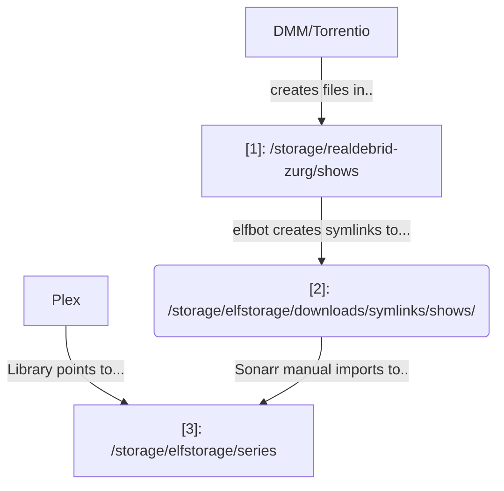

# {{ page.meta.slug }}

Sonarr is a PVR for Usenet and BitTorrent users. It can monitor multiple RSS feeds for new episodes of your favorite shows and will grab, sort and rename them. 

It can also be configured to automatically upgrade the quality of files already downloaded when a better quality format becomes available. 




## How do I use it?

Once you've enabled it in [your account](https://elfhosted.com/tenant/apps/0), launch the app via your dashboard.

Sonarr will be pre-configured for the other supported apps. By default, Sonarr HD is configured to seek out only 1080P content which can reliably be direct-played / transcoded on a range of equipment and bandwidth constraints. If you have the hardware / bandwidth to direct-play 4K content, you'll need to update the profiles yourself.

## Import existing remote media

If you have existing remote media mounted at `/storage/<something>` (*like Real-Debrid*), you can [use ElfBot to create symlinks](/app/elfbot#how-to-import-symlinks) to bring this into your Sonarr library, without consuming any more space.

Here's how the process works. The end result is that Plex only sees `[3]: /storage/elfstorage/series`:

To perform a symlink import using [ElfBot][elfbot], run `elfbot symlink /storage/realdebrid-zurg/shows`. ElfBot will symlink any **new**  content at `/storage/realdebrid-zurg/shows` to `/storage/elfstorage/download/symlinks/shows`. After this, use Sonarr to perform an automatic / interactive manual import from `/storage/elfstorage/download/symlinks/shows/`.

In Sonarr, use `Wanted` -> `Manual Import`, and point the import at `/storage/elfstorage/downlods/symlinks/shows/`, as illustrated below:

!!! warning "Not Library Import"
    We're not importing an organized library here, we're importing a messy bunch of files created by DMM / Stremio. Use `Wanted` -> `Manual Import` instead, since this will rename and upgrade your content, and move it to existing libraries

