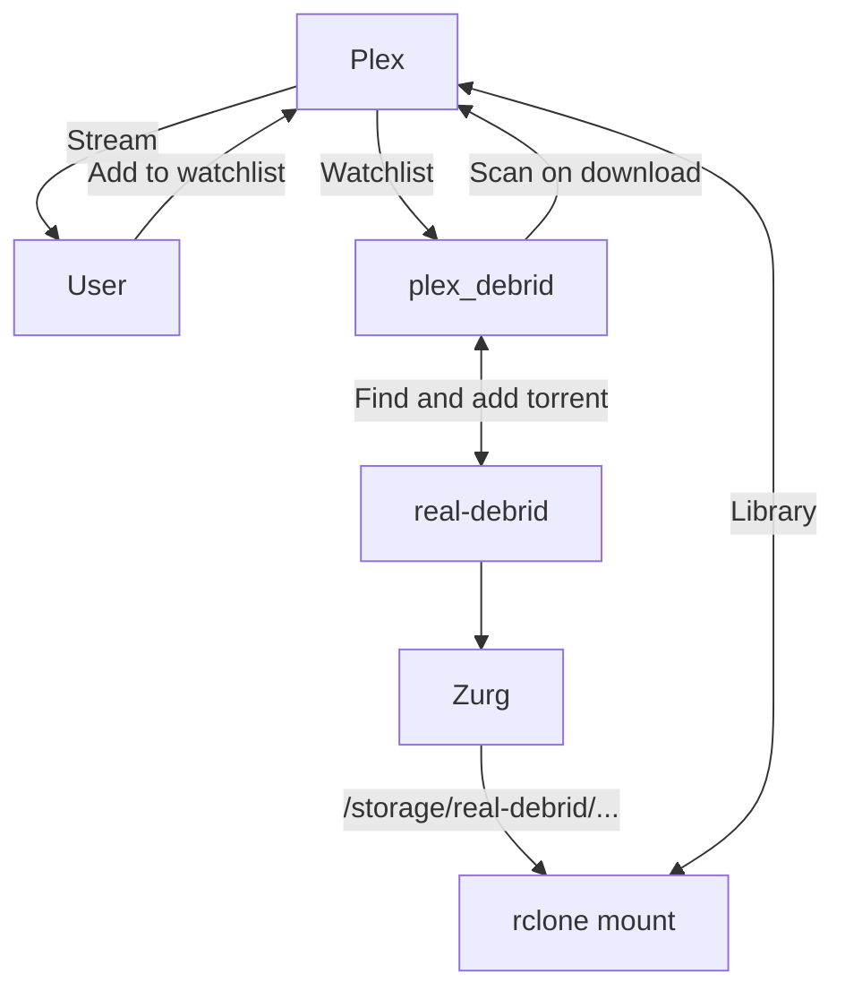

# Turn-key solution to Plex-Debrid streaming

Today we welcome [plex-debrid][plex-debrid], another piece of the puzzle for simple Plex debrid-based streaming. Plex-debrid lets you use your Plex watchlist as a "watchlist" (*haha*), scraping public trackers for the debrid-cached releases, and adding them to your [Real-Debrid][real-debrid]. It then triggers a rescan of the Plex library, so that **in theory**, the media is available to stream within 10-20s!

## Plex-Debrid "Infinite" streaming

This is a beginner-friendly solution which avoids dealing with torrents, trackers, ratios, VPNs, and storage limits. The trade-off, of course, is that you don't **own** the media - it's streamed to you from your debrid service, for as long as you have a valid subscription.

Here's a little diagram showing how simple it can be:

And here's a demo from the plex_debrid repo..

<!-- more -->

{ loading=lazy }

I've written up the process in detail in a [new guide](/guides/media/stream-from-real-debrid-with-plex/) :thumbsup:

## RIP Plex BYO VPN

Ha, gotcha with the clickbait :smiling_imp:

You no longer need to BYO VPN to use Plex on ElfHosted! :partying_face:

Here's the deal - We added the BYO VPN to our Plex product when Plex first threatened to ban Hetzner IPs in Oct 2023, and it was unclear whether it would work or not. As it turned out, it worked very well, and Plex **only** uses the VPN for metadata-grabbing, and for phoning-home to Plex HQ.

Since the solution works so well, there's almost no load on the VPN, I realised that I can just attach a shared VPN to all of our Plex pods, to avoid the Hetzner ban. It's not really required for each user to BYO VPN..

So.. I've re-enabled the regular "[Plex][store/plex]" product in the store, and hidden all of the VPN-specific variants. If you're subscribed to a Plex+VPN product, you can switch over by removing it from your sub, and just adding Plex. Or you can do nothing, and Plex will continue to work for you as it currently does. But new users to the store will no longer be confused as to why there are 10+ Plex products!

## Store upgraded

Was the store sluggishly slow for you? It was for me, here in NZ! It turns out that there's a specific set of skills and resources required to run Wordpress+Woocommerce well, and me and my little Digital Ocean Kubernetes cluster weren't cutting it! 

The store has moved to a dedicated Wordpress/Woocommerce provider, Rocket.net, with fancy CDNs and caching magic, and after a few hiccups (*cough, cough, SSO*), it seems to be working nicely now, and **much** faster.

Check out these before / after results:

Before (*different site, but same cluster*)

After:

So now SSO is much more reliable, the store is faster, hopefully resulting in better SEO and new user retention!

## Today's scoreboard

:material-target: Metric | Numberz
---------|----------
:fontawesome-regular-circle-user: Total subscribers | 127
:fontawesome-solid-hard-drive: Storageboxes mounted | 23
:floppy_disk: ElfStorage in TBs | 41
:material-sync: Rclone mounts | 12
:material-dolphin: Tenant pods | 1214
:material-bug: Bugz squished | 0
:fontawesome-solid-gamepad: New toyz | 2

### Summary

As always, thanks for building with us - feel free to share suggestions, and your own ideas for new apps to add!

--8<-- "common-links.md"