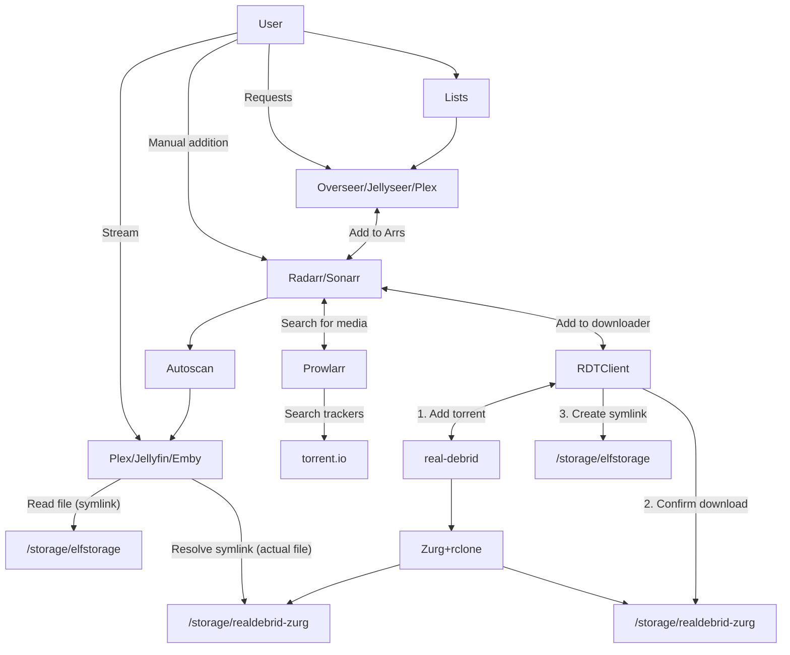

# Advanced Infinite Streaming with Plex

Further to our recent addition of [plex-debrid][plex-debrid] tools and a [minimal streaming guide](/guides/media/stream-from-real-debrid-with-plex/), I've added [an advanced guide](/guides/media/stream-from-real-debrid-with-plex-radarr-sonarr-prowlarr/) on using [RDTClient][rdtclient] and the Seers + Arrs to manage your Real Debrid "infinite library"

Check out this sexy :mermaid: flowchart..

<!-- more -->



More details in the [advanced guide](/guides/media/stream-from-real-debrid-with-plex-radarr-sonarr-prowlarr/) :thumbsup:

## Update on ElfBuckz top-ups not topping-up

The developers of the plugin we use for ElfBuckz have responded to me on the issue of occasional topups failing. Apparently the [fault lay with the PayPal payments plugin](https://wordpress.org/support/topic/conflict-with-woocommerce-payments-throws-exception-looking-for-paypal-meta/), which broke some Woocommerce automations. This is supposedly now fixed, but if you do notice your top-ups failing again, [let me know][elfhelp]!

## Update on Subscriptions stuck on hold

With the help of another affected user, I got to the bottom of why we were seeing some subscriptions paused, or stuck "on hold" even after successfully renewing them, and it's not what you'd think..

Woocommerce emits orders for every change to your subscription, based on a "subscription" ID (*low numbers*), and ever increasing order IDs (*high numbers*). Users can have multiple subscriptions, so as a result, we "summarize" all your services by combining a collection of files which look like this:

```bash
subscription-123.yaml
subscription-456.yaml
subscription-10945.yaml
```

While these files were sorted numerically in VSCode (*where I look at them*), it turns out Bash was sorting them **alphabetically**, like this:

```bash
subscription-10945.yaml
subscription-123.yaml
subscription-456.yaml
```

In the case of the example above, if order `123` had been an "on hold" order, it would have overwritten any changes applied in order `10945` (*the files are mergd downwards*).

This curly little bug is now to bed :bed:, and subscriptions and renewals should be more stable now!

## Today's scoreboard

:material-target: Metric | Numberz | Delta
---------|----------|----------
:fontawesome-regular-circle-user: Total subscribers | 131 | +4
:fontawesome-solid-hard-drive: Storageboxes mounted | 22 | 0
:floppy_disk: ElfStorage in TBs | 47 | +1
:material-sync: Rclone mounts | 33 | +10 [^1]
:material-dolphin: Tenant pods | 1340 | +51
:material-bug: Bugz squished | 5 | +2
:fontawesome-solid-gamepad: New toyz | 1 | +1

### Summary

As always, thanks for building with us - feel free to share suggestions, and your own ideas for new apps to add!

--8<-- "common-links.md"

[^1]: The big increase here is due to all the Zurg mounts!