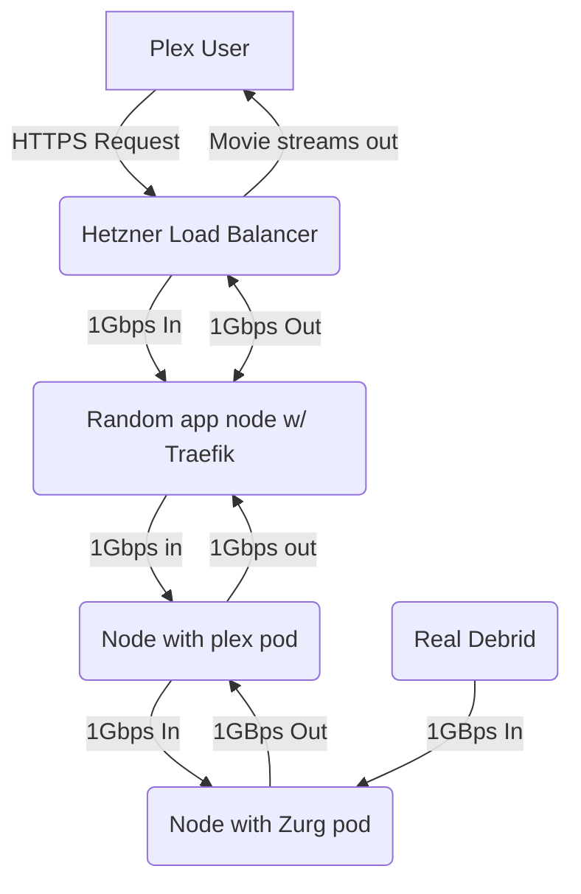
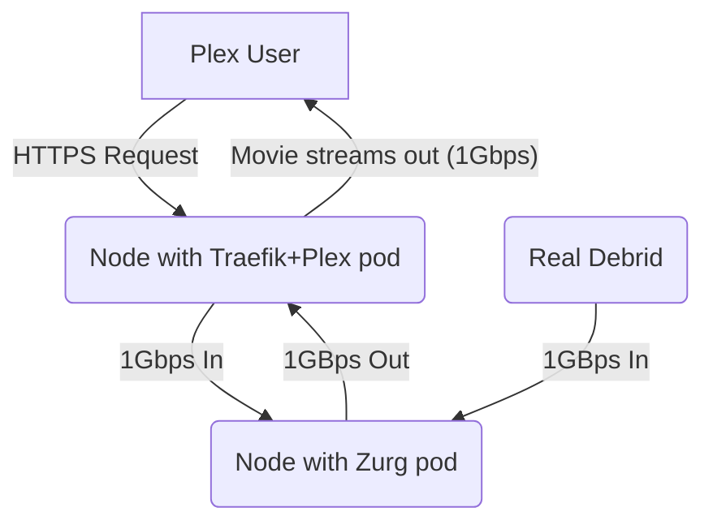
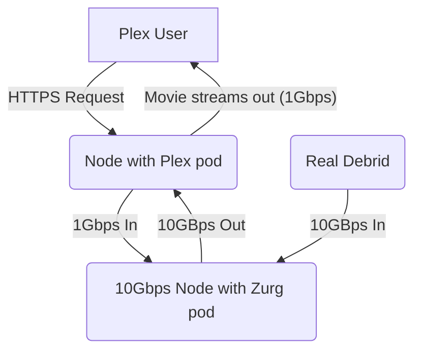

# Scaling the gigabytes

We saw some stability issues earlier this week, as increased load impacted our ceph cluster, which provides the backend to the application config folders, as well as to ElfStorage.

It turned out that the 1Gbps nodes which run our SSD-backed config storage were also running the Ceph metadata servers, whose job it is to co-ordinate your view of the filesystems of your volumes. The combination of these two roles (*storage and metadata*) was saturating the 1Gbps NICs, causing slowdowns and the occasional corruption as the fault cascaded.

In parallel, all the fun we've been having with Real-Debrid streaming was impacting our app nodes, in some cases creating so much incoming traffic that the nodes were unable to respond timeously to communications with ceph, again resulting in slowdows and corruption.

Here's are a few recent changes we've made to address growth:

<!-- more -->

## Optimized routing to streamers

Most of our incoming HTTPs traffic arrives via a Hetzner network load balancer, and is then passed to a random app node (*running Traefik*), to be SSL-terminated, and then passed on again to the target pod. This offers excellent resilience and fault-tolerance, but can result in an inefficient traffic path, as illustrated below:



As you can see, based on the randomness of the load-balancing, a simple Plex / Debrid stream of a 50GB movie could pass through 3 different nodes, in some cases simply "passing through" on the way out. While we have **some** ability to rate-limit traffic, you can only really control the rate of **outgoing** traffic - you don't get to determine how fast **incoming** traffic arrives, and once it's arrived, it's too late to do anything about it!

## DNS-based routing to streamers

The first change implemented this week works as follows - every time a streamer ([Plex][plex], [Jellyfin][jellyfin], [Emby][emby]) starts, a DNS record is created/updated for that streamer's URL (*say, `funkypenguin-plex.elfhosted.com`*), pointing to the precise host the streamer is running on.

This means that rather than having the incoming request routed via Hetzner's load balancer to a random node running Traefik, the request hits the Traefik pod on the **precise** node that Plex is running on, avoiding any overhead in delivering streaming traffic between Traefik and Plex:



## 10Gbps for Zurg and incoming friends

The DNS-based routing improves the flow of traffic, but it doesn't solve the problem of incoming media saturating the 1Gbps link and making nodes briefly unresponsive.

Hetzner offer 10Gbps uplinks on nodes, but it's double the price, and you're charged for traffic (*critically, **egress** traffic*) over 20TB / month.

So we added some 10Gbps nodes, and moved all the Zurg instances onto them. Now our streaming traffic flow looks like this:



Now there's no saturation of the Zurg node, and we **can** control the rate of traffic sent from the Zurg node to the Plex nodes, such that we don't get massive traffic spikes causing issues.

To avoid having to pay extra egress charges, we've moved only the downloading apps which don't upload ([SABnzbd][sabnzbd], [NZBGet][nzbget], and [RDTClient][rdtclient]) onto the 10Gbps nodes, so you should now see much better performance from these apps!

## 10Gbps for Ceph MDSs

Remember those saturated MDSs? It turns out, they **love** a little extra room to stretch their legs, and are running much better on the 10Gbps nodes as well. Here's our current Ceph status:

```
  cluster:
    id:     d412a851-baeb-4e20-a12c-824cf1d43803
    health: HEALTH_OK

  services:
    mon: 3 daemons, quorum c,e,f (age 10h)
    mgr: a(active, since 5d), standbys: b
    mds: 3/3 daemons up, 3 hot standby
    osd: 46 osds: 46 up (since 5d), 46 in (since 5w)

  data:
    volumes: 3/3 healthy
    pools:   18 pools, 1948 pgs
    objects: 23.17M objects, 48 TiB
    usage:   82 TiB used, 287 TiB / 369 TiB avail
    pgs:     1944 active+clean
             4    active+clean+scrubbing+deep

  io:
    client:   95 MiB/s rd, 20 MiB/s wr, 392 op/s rd, 250 op/s wr
```

## Ready to grow

Infrastructure-wise, we're now more equipped for growth without any short-term bottlenecks - here's what the cluster effectively[^2] looks like today:

```
NAME       CPU(cores)   CPU%   MEMORY(bytes)   MEMORY%
dwarf01    179m         2%     23500Mi         73%
dwarf02    168m         2%     22951Mi         72%
dwarf03    203m         2%     23560Mi         74%
dwarf04    205m         2%     23924Mi         75%
dwarf05    196m         2%     23789Mi         74%
dwarf06    146m         1%     23789Mi         74%
dwarf07    178m         2%     24484Mi         76%
dwarf08    176m         2%     23559Mi         74%
dwarf09    207m         2%     23828Mi         74%
dwarf10    180m         2%     23489Mi         73%
elf01      2229m        13%    31708Mi         49%
elf02      2222m        13%    28819Mi         44%
elf03      2068m        12%    37913Mi         29%
elf04      3080m        19%    34664Mi         26%
elf05      1907m        11%    38004Mi         29%
elf06      1997m        12%    29751Mi         46%
elf07      2060m        12%    29364Mi         45%
elf08      2653m        16%    40636Mi         31%
fairy01    1306m        16%    41276Mi         64%
fairy02    972m         12%    43288Mi         67%
fairy03    2730m        34%    50427Mi         78%
giant01    1159m        9%     31114Mi         48%
giant02    354m         2%     5590Mi          8%
giant03    137m         1%     5924Mi          9%
goblin01   218m         1%     33723Mi         26%
goblin02   229m         1%     32071Mi         24%
goblin03   161m         1%     30721Mi         23%
```

!!! question "Why are the dwarves and giants so idle?"
    They're our Ceph HDD (*dwarves*) and SSD (*goblins*) storage nodes. What you don't see in these metrics are their disk I/O or network usage, which are likely high.

## Today's scoreboard

:material-target: Metric | Numberz | Delta
---------|----------|----------
:fontawesome-regular-circle-user: Total subscribers | 172 | +24
:fontawesome-solid-hard-drive: Storageboxes mounted | 17 | +5
:floppy_disk: ElfStorage in TBs | 48 | -
:material-sync: Rclone mounts | 98 | +45 [^1]
:material-dolphin: Tenant pods | 2123 | +605
:material-bug: Bugz squished | 2 | -
:fontawesome-solid-gamepad: New toyz | - | -

### Summary

As always, thanks for building with us - feel free to share suggestions, and your own ideas for new apps to add!

--8<-- "common-links.md"

[^1]: The big increase here is due to all the Zurg mounts!
[^2]: I've excluded some nodes which have been de-provisioned and are awaiting expiry at the end of their monthly Hetzner invoice cycle
