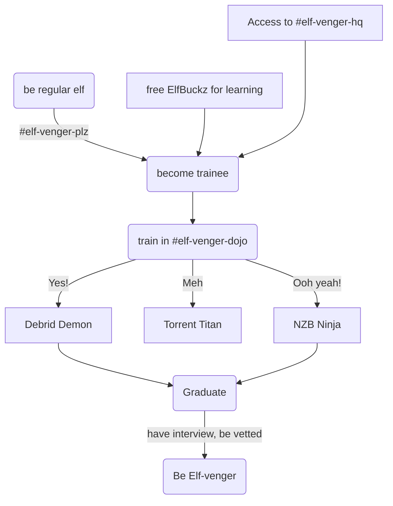

# Scaling the humans (Elf-vengers, Assemble!)

Yesterday's blog post was heavy on the technical details re [scaling our infrastructure for growth](/blog/2024/01/28/scaling-the-gigabytes/). Ironically, after bragging about how we're "ready" for growth, today we had an an issue affecting multiple users, which **looks** like it was caused by utilization / saturation :facepalm:

However, I can't confirm this, because.. the latest Grafana / Kube Prometheus Stack update broke graphing, and we've been flying blind for the last few days while I try to fix it while also adding new apps, welcoming new users, and handling routine support!

So the real problem here is the human (me) isn't scaling under load, which is why I've assembled you all to present my new initiative...

<!-- more -->
## The Elf-vengers Initiative

As our platform grows, the community is only going to grow, and I'm looking to recruit, from our existing user base, a team of experienced volunteers who will:

* Help onboard new users and support existing ones, so that private tickets don't go unanswered for hours, while I sleep :sleeping:
* Debug and solve edge-cases which require careful testing (*i.e. "Latest Sonarr + 4K + TRaSH Guides + RDTClient = ?"*) :scientist:
* Represent ElfHosted in related channels (*other Discords, Reddit, etc*), supporting existing users and recruiting new ones :hugging:

In my head, I've named this team "The Elf-vengers", and I've given some thought about a regular user might progress into a mighty hero..

### Becoming an Elf-venger

You'll find more details, including "user stories", [here](/team/#elf-vengers), but here's the process in a nutshell:

### Process

1. Become a trainee (automatic), by visiting [#elf-venger-plz](https://discord.com/channels/396055506072109067/1198400497632153630), and clicking on the emoji reaction
2. Get access to the #elf-venger-dojo, with behind-the-scenes resources, and coupon codes for free apps for testing
3. When confident, "graduate" (*be vetted in a 1:1 DM*) in your chosen disciplines,
4. Get elf-venger role

!!! question "What is vetting and will it hurt? :fontawesome-regular-face-surprise:"
    Not unless you're an imposter! :smiling_imp: The purpose of vetting is simply to establish a level of trust such that you can participate in private support channels with users who may share sensitive information (*credentials, etc*). I'll ask you to authenticate yourself somehow, be it LinkedIn, domain ownership, or just IRL details.

### Assemble!

So that's it. The whole pitch. This may not go as planned, but it's a start - if you're interested in helping out, get in touch, or just jump in, at [#elf-venger-plz](https://discord.com/channels/396055506072109067/1198400497632153630)

## New Toyz

### Stremio-Jackett

We do have a new pair of apps today - introducing [Jackett][jackett] and [Stremio-Jackett][stremio-jackett]. Stremio is popular with the Debrid crowd, because it runs on heaps of older devices (*like little old $20 Android TV boxes that Plex wouldn't touch with gloves on!*), and can basically play **anything**, with the help of an expansive ecosystem of addons.

Combining Stremio with torrentio is a common way for non-technical users to enjoy the wonders of streaming torrents via Debrid providers, but the typical (free) "torrentio" addon is becoming increasingly overwhelmed and rate-limited, and lots of slightly geekier users are looking for alternatives.

Stremio-Jackett is a one-and-a-half-week-old project which adds a stremio-compatible API in front of Jackett, such that you can basically fulfill your torrent-streaming requirements from your own selection of public (*or even private*) trackers.

This is not a [Zurg][zurg]-like solution, where traffic is proxied via ElfHosted, and thus only appears come from one IP from the provider's perspective. This is simply a searching-and-serving design intended to help existing Stremio users expand their selection of content, or the reliability of their addons.

There's a detailed guide [here](/guides/media/stream-from-real-debrid-with-stremio-jackett/), and the end result looks something like this:

### Summary

As always, thanks for building with us - feel free to share suggestions, and your own ideas for new apps to add!

--8<-- "common-links.md"
