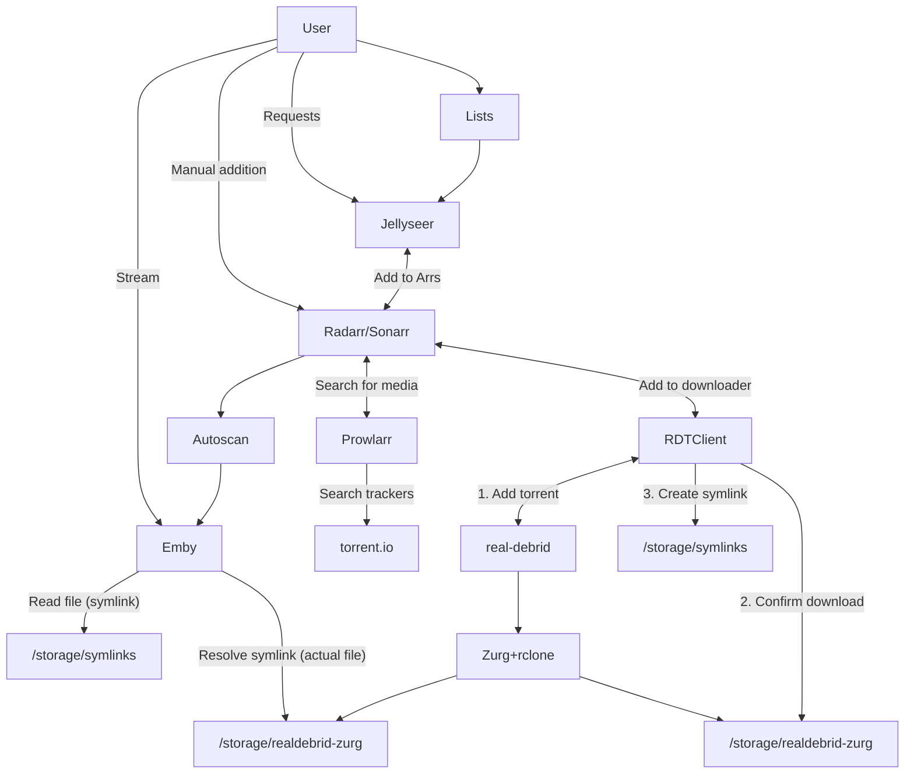

# "Infinite streaming" from Real Debrid with Emby, Prowlarr, Radarr, and Sonarr

The following page guides the user through the process of establishing an ElfHosted "Infinite Streaming" stack using [Emby][emby], with media stored on [RealDebrid][real-debrid], and with content acquisition managed by [Radarr][radarr] and [Sonarr][sonarr], to search, source, and sort your media, stealthily using symlinks to skip storage stresses!

An enhanced, "ScribeHow" version of this page can be found [here](https://fnky.nz/elfguide-emby-realdebrid-aars).

The stack described below is available in all of our [regular stack bundles](https://store.elfhosted.com/product-category/streaming-bundles/), and free trials are available on the [hobbit](https://store.elfhosted.com/product/hobbit-emby-realdebrid-aars/) bundles.

[Get your 7 day free trial!](https://store.elfhosted.com/product/hobbit-emby-realdebrid-aars/){ .md-button .md-button--primary }

## Requirements

* [x] [Real-Debrid account][real-debrid] and [API token](https://real-debrid.com/apitoken)
* [x] Subscribe to the ElfHosted ["Hobbit" Infinite Arr Emby Streaming bundle](https://store.elfhosted.com/product/hobbit-emby-arrs-real-debrid-infinite-streaming-bundle)

## How does it work?

Here's a diagram (*it's not as complicated as it looks!*), followed by some explanations:

1. The user adds content to their [Radarr][radarr] / [Sonarr][sonarr], or [Jellyseerr][jellyseerr]
2. Radarr / Sonarr notice the the new addition, and search Prowlarr (*torrentio indexer*) for appropriate files (*matching size, quality, language parameters*)
3. When an appropriate release is found, Radarr / Sonarr schedules a download via [RDTClient][rdtclient], which is presenting a qBittorrent-like API
4. RDTClient adds the torrent to Real-Debrid, and then monitors the zurg rclone mount to confirm the download has succeeded. Upon success, RDTClient **symlinks** the download to Radarr/Sonarr's `completed` directory, and they process is as if it were a local download (*renaming and moving to the media path*)
5. Aars trigger autoscan, which in turn triggers Emby to re-scan the media path containing the new content, and the Plex library is updated!

!!! question "Why not just use [plex_debrid][plex-debrid]?"

    1. For one thing, it only works with Plex :facepalm:
    2. You can use the Aars ability to select custom qualities per movie / show
    3. Integration into Jellyseerr / Arrs is well-understood and mature, and lets friends-and-family request content (*without complicated Plex Watchlist integrations*)

## How to set it up

1. Purchase a subscription to the ["Hobbit" Infinite Arr Emby Streaming bundle](https://store.elfhosted.com/product/hobbit-emby-arrs-real-debrid-infinite-streaming-bundle)
2. Get a [Real-Debrid account][real-debrid] subscription for your ElfHosted account (*can't be used elsewhere at the same time, else you risk being banned*), and copy your [API token](https://real-debrid.com/apitoken)
3. Log into your ElfHosted dashboard (`https://<your username>.elfhosted.com`), and navigate to **Tools** -> **Filebrowser**. Within FileBrowser, navigate to `/config/zurg`, and open your `config.yml` file. Paste your token after the `token: ` line.







### Setup Blackhole (default)

Setup [Blackhole][blackhole] with your RD credentials (*enabled by default in the Aars*)

### Setup RDTClient (optional)

Configure [RDTClient], by pasting your debrid provider's details into the config section (*the rest is pre-configured*). Disable blackhole (*enabled by default*), and enabled RDTClient as a downloader instead.

## Success!

That's it! You've got the basic plumbing in place for "unlimited storage" from Real-Debrid, managed by the Arrs and streamed by Emby!

!!! warning "Beware Real-Debrid IP bans"
    Be aware that Real-Debrid states:
    
    > You can use your account from any public IP address but you can't use your account from more than one public IP address at the same time.

    So if you use RealDebrid **outside** of ElfHosted, it's likely that your account may be warned / banned.
    
## How do I get help?

1. For general use of the [individual tools](/apps/), refer to the each app's upstream site
2. For specific support re your ElfHosted configuration / account, see the [ElfHosted support options](/get-help/

--8<-- "common-links.md"

