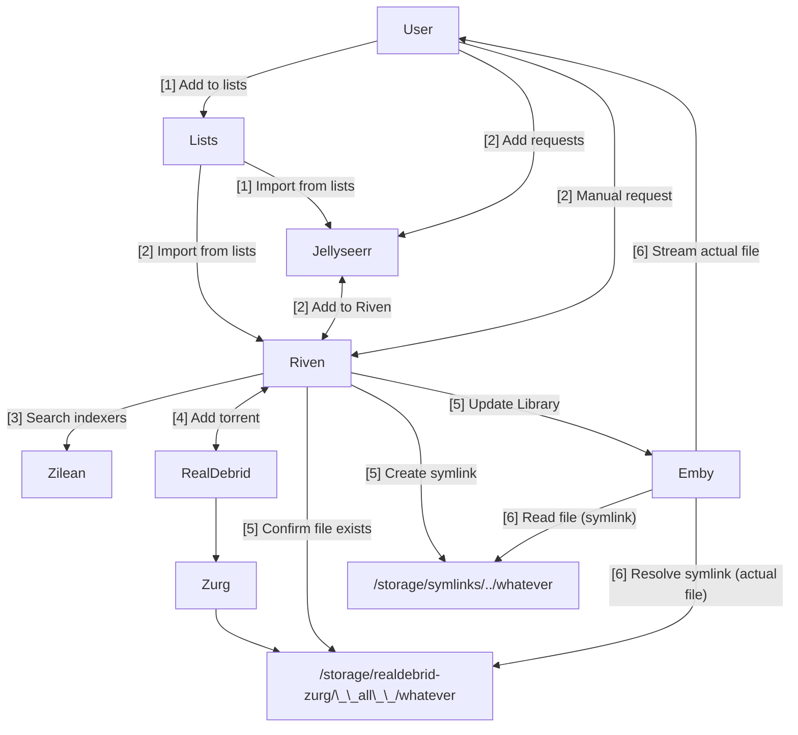

# Ultimate guide to Emby, RealDebrid, and Riven

The following page guides the user through the process of establishing an ElfHosted stack using [Emby][emby], with media stored on [RealDebrid][real-debrid], and with content acquisition managed by [Riven][riven].

An enhanced, "ScribeHow" version of this page can be found [here](https://fnky.nz/elfguide-emby-realdebrid-riven).

The stack described below is available in all of our [regular stack bundles](https://store.elfhosted.com/product-category/streaming-bundles/), and free trials are available on the [Starter](https://store.elfhosted.com/product/starter-emby-realdebrid-riven/) and [Hobbit](https://store.elfhosted.com/product/hobbit-emby-realdebrid-riven/) bundles.

[Get your 7 day free trial!](https://store.elfhosted.com/product/starter-emby-realdebrid-riven/){ .md-button .md-button--primary }

## Requirements

* [x] [Real-Debrid account][real-debrid] and [API token](https://real-debrid.com/apitoken)
* [x] Subscribe to the ElfHosted [Starter](https://store.elfhosted.com/product/starter-emby-realdebrid-riven/) or [Hobbit](https://store.elfhosted.com/product/hobbit-emby-realdebrid-riven/) bundles.

## How does it work?

Here's a diagram (*it's not as complicated as it looks!*), followed by some explanations:

1. The user adds items to lists (*Plex watchlist, TMDB list, etc*), which is then added to Overseerr, or directly to Overseerr
2. Or, the user adds items directly to their [Riven][riven] or [Jellyseerr][jellyseerr] (*which adds them to the Riven*)
3. Riven receives the new requests, and searches indexers (like Zilean) for appropriate files (*matching size, quality, language parameters*)
4. When an appropriate media is found, Riven adds the content to RealDebrid.
5. Riven watches Zurg's `__all__` folder to confirm the media is successfully added to RealDebrid, and creates a symlink in the appropriate `movies` or `shows` folder, pointing to the original media in the `__all__`folder. Riven triggers a Library update in Emby. 
6. When the user streams the media, Emby looks in the symlink folder, retrieves the file (*transparently, this is fulfilled by the symlink to the "real" files*), and streams it to the user

## Setup 

### Add RealDebrid account



### Setup Emby for Riven



### Connect Riven to Jellyseerr



--8<-- "common-links.md"

