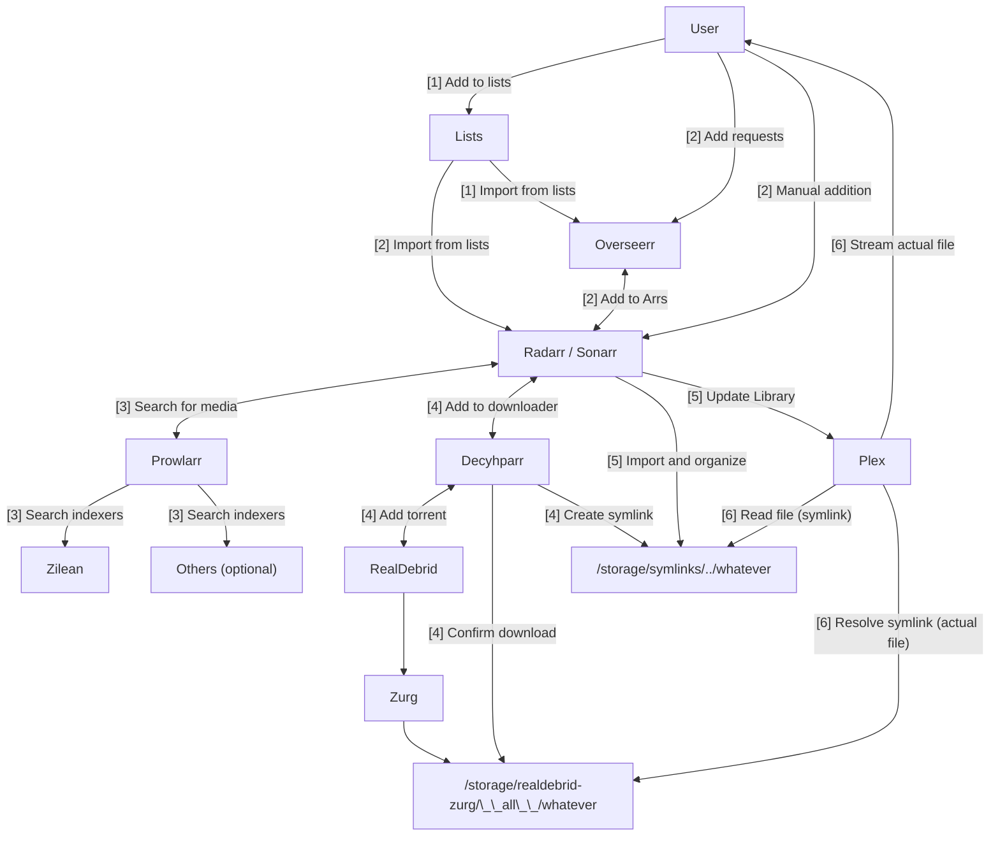

# "Infinite streaming" from Real Debrid with Plex, Prowlarr, Radarr, and Sonarr

The following page guides the user through the process of establishing an ElfHosted "Infinite Streaming" stack using [Plex][Plex], with media stored on [RealDebrid][real-debrid], and with content acquisition managed by [Radarr][radarr] and [Sonarr][sonarr], to search, source, and sort your media, stealthily using symlinks to skip storage stresses!

An enhanced, "ScribeHow" version of this page can be found [here](https://fnky.nz/elfguide-plex-realdebrid-aars).

The stack described below is available in all of our [regular stack bundles](https://store.elfhosted.com/product-category/streaming-bundles/), and \$1, 7-day trials are available on the [hobbit](https://store.elfhosted.com/product/hobbit])-sized bundles.

[Get your $1, 7-day free trial!](https://store.elfhosted.com/product/hobbit/){ .md-button .md-button--primary }

## Requirements

* [x] [Real-Debrid account][real-debrid] and [API token](https://real-debrid.com/apitoken)
* [x] Subscribe to an ElfHosted [infinite streaming bundle](https://store.elfhosted.com/product-category/streaming-bundles/), and customise with Plex, RealDebrid, and Radarr/Sonarr.

## How does it work?

Here's a diagram (*it's not as complicated as it looks!*), followed by some explanations:

1. The user adds items to lists (*Plex watchlist, TMDB list, etc*), which is then added to Overseerr, or directly to Radarr/Sonarr..
2. Or, the user adds items directly to their [Radarr][radarr] / [Sonarr][sonarr], or [Overseerr][overseerr] (*which adds them to the Aars*)
3. Radarr / Sonarr notice the the new addition, and search Prowlarr for appropriate files (*matching size, quality, language parameters*)
4. When an appropriate release is found, Radarr / Sonarr schedules a download via [Blackhole][blackhole]. Blackhole adds the content to RealDebrid (*or fails and triggers a retry if it's not cached*), and moves the file into a `completed` folder
5. Radarr / Sonarr notice the file in the `completed` folder, process it into the intended root folder, and notify Plex of a library update
6. When the user streams the media, Plex looks in the symlink folder, retrieves the file (*transparently, this is fulfilled by the symlink to the "real" files*), and streams it to the user

## How to set it up

1. Subscribe to an Plex/Aars/RealDebrid configured [Streaming bundle](https://store.elfhosted.com/product-category/streaming-bundles/)
2. Get a [Real-Debrid account][real-debrid] subscription for your ElfHosted account (*shouldn't be used elsewhere at the same time, else you risk being banned*), and copy your [API token](https://real-debrid.com/apitoken)
3. Log into your ElfHosted dashboard (`https://<your username>.elfhosted.com`), and navigate to **Tools** -> **Filebrowser**. Within FileBrowser, navigate to `/config/zurg`, and open your `config.yml` file. Paste your token after the `token: ` line.
4. Optionally (*recommended*), navigate to **Decypharr** from your ElfHosted dashboard, and enter your API key under `Settings` -> `Debrid`. Grab [this subscription](https://store.elfhosted.com/product/decypharr-replaces-zurg/) to force your stack to prefer Decypharr's WebDAV feature over Zurg (*beta but much faster!*).









### Setup Decyhparr 

Setup [Decypharr][decypharr] with your RD credentials (*enabled by default in the Aars*)

## Success!

That's it! You've got the basic plumbing in place for "unlimited storage" from Real-Debrid, managed by the Arrs and streamed by Plex!

!!! warning "Beware Real-Debrid IP bans"
    Be aware that Real-Debrid states:
    
    > You can use your account from any public IP address but you can't use your account from more than one public IP address at the same time.

    So if you use RealDebrid **outside** of ElfHosted, it's likely that your account may be warned / banned.
    
## How do I get help?

1. For general use of the [individual tools](/apps/), refer to the each app's upstream site
2. For specific support re your ElfHosted configuration / account, see the [ElfHosted support options](/get-help/)

--8<-- "common-links.md"

