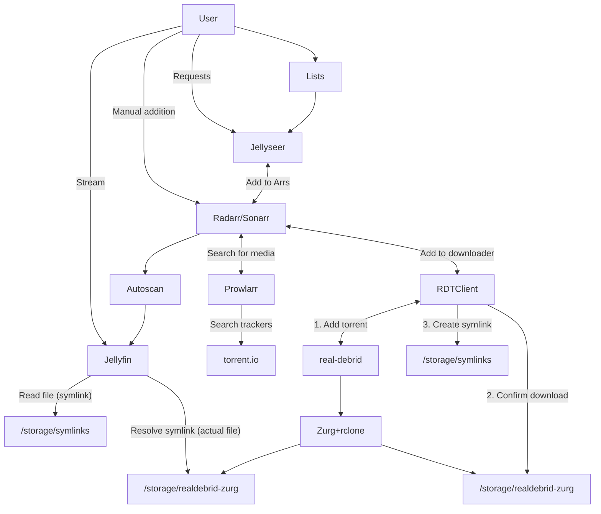

# "Infinite streaming" from Real Debrid with Jellyfin, Prowlarr, Radarr, and Sonarr

This page describes a more complex, flexible version of our [plex_debrid-based, minimal solution](/guides/media/stream-from-real-debrid-with-plex/) to create your "infinite" Jellyfin library, utilizing [Real-Debrid][real-debrid] for all media, streaming through your ElfHosted Jellyfin instance.

The solution leverages the popular Arr tools to search, source, and sort your media, stealthily using symlinks to skip storage stresses!

## Requirements

* [x] [Real-Debrid account][real-debrid] and [API token](https://real-debrid.com/apitoken)
* [x] ElfHosted's ["Hobbit" Infinite Jellyfin Arr Streaming bundle](https://store.elfhosted.com/product/hobbit-jellyfin-arrs-real-debrid-infinite-streaming-bundle)

<iframe width="560" height="315" src="https://www.youtube-nocookie.com/embed/HFUH05riD-I?si=aqNp2midUEarPsCO" title="YouTube video player" frameborder="0" allow="accelerometer; autoplay; clipboard-write; encrypted-media; gyroscope; picture-in-picture; web-share" referrerpolicy="strict-origin-when-cross-origin" allowfullscreen></iframe>

## How does it work?

Here's a diagram (*it's not as complicated as it looks!*), followed by some explanations:

1. The user adds content to their [Radarr][radarr] / [Sonarr][sonarr], or [Jellyseerr][jellyseerr]
2. Radarr / Sonarr notice the the new addition, and search Prowlarr (*torrentio indexer*) for appropriate files (*matching size, quality, language parameters*)
3. When an appropriate release is found, Radarr / Sonarr schedules a download via [RDTClient][rdtclient], which is presenting a qBittorrent-like API
4. RDTClient adds the torrent to Real-Debrid, and then monitors the zurg rclone mount to confirm the download has succeeded. Upon success, RDTClient **symlinks** the download to Radarr/Sonarr's `completed` directory, and they process is as if it were a local download (*renaming and moving to the media path*)
5. Aars trigger autoscan, which in turn triggers Jellyfin to re-scan the media path containing the new content, and the Plex library is updated!

!!! question "Why not just use [plex_debrid][plex-debrid]?"

    1. For one thing, it only works with Plex :facepalm:
    2. You can use the Aars ability to select custom qualities per movie / show
    3. Integration into Jellyseerr / Arrs is well-understood and mature, and lets friends-and-family request content (*without complicated Plex Watchlist integrations*)

## How to set it up

Here's a little more detail..

1. Purchase a subscription to the ["Hobbit" Infinite Arr Jellyfin Streaming bundle](https://store.elfhosted.com/product/hobbit-jellyfin-arrs-real-debrid-infinite-streaming-bundle)
2. Get a [Real-Debrid account][real-debrid] subscription for your ElfHosted account (*can't be used elsewhere at the same time, else you risk being banned*), and copy your [API token](https://real-debrid.com/apitoken)
3. Log into your ElfHosted dashboard (`https://<your username>.elfhosted.com`), and navigate to **Tools** -> **Filebrowser**. Within FileBrowser, navigate to `/config/zurg`, and open your `config.yml` file. Paste your token after the `token: ` line.

### Setup Jellyfin

Log into [Jellyfin][jellyfin], enable hardware transcoding, and setup the media libraries in `/storage/symlinks/{movies,series,movies-4k,series-4k, etc}`. Setup an API key for autoscan, and keep it for later.

### Setup RDTClient

Configure [RDTClient], by pasting your debrid provider's details into the config section (*the rest is pre-configured*).

### Setup Prowlarr

Navigate to Prowlarr, and configure ElfHosted's torrentio internal indexer (*search "torrentio"*). In the properties of the indexer, set your `Real-Debrid API Key`, test, and save.

Run `Sync App Indexers` to add the indexers (*via Prowlarr*) to Radarr and Sonarr.

### Setup Radarr / Sonarr

Configure your **Root Folders** to `/storage/symlinks/<whatever>`, since this is where the symlinks will appear. You do **not** need `/storage/realdebrid-zurg` (*in fact, its read-only nature will just confuse the Arr!*)

### Setup Autoscan

Radarr / Sonarr are pre-configured for [Autoscan][autoscan], but you'll need to edit Autoscan's config (`config/autoscan/` in [FileBrowser][filebrowser]), and add a token for Jellyfin, in order for the autoscanning to work.

## Success!

That's it! You've got the basic plumbing in place for "unlimited storage" from Real-Debrid, managed by the Arrs and streamed by Jellyfin!

!!! warning "Beware Real-Debrid IP bans"
    Be aware that Real-Debrid states:
    
    > You can use your account from any public IP address but you can't use your account from more than one public IP address at the same time.

    So if you use RealDebrid **outside** of ElfHosted, it's likely that your account may be warned / banned.
    
## How do I get help?

1. For general use of the [individual tools](/apps/), refer to the each app's upstream site
2. For specific support re your ElfHosted configuration / account, see the [ElfHosted support options](/get-help/

--8<-- "common-links.md"

