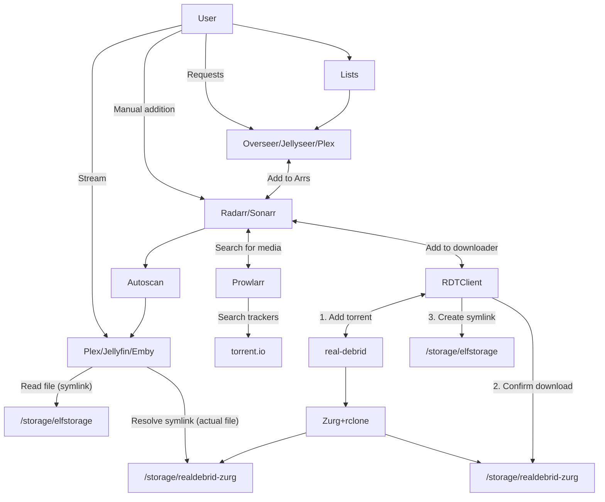

# "Infinite streaming" from Real Debrid with Plex, Prowlarr, Radarr, and Sonarr

This page describes a more complex, flexible version of our [plex_debrid-based, minimal solution](/guides/media/stream-from-real-debrid-with-plex/) to create your "infinite" Plex library, utilizing [Real-Debrid][real-debrid] for all media, streaming through your ElfHosted Plex instance.

The solution leverages the popular Arr tools to search, source, and sort your media, stealthily using symlinks to skip storage stresses!

!!! tip "New accounts get $10 credit, enough to run this stack for 20 days!"
    Our services are subscribed to in "[ElfBuckz][elfbuckz]", our in-store account credit. All new users get $10 ElfBuckz upon [account creation](https://store.elfhosted.com/my-account/), in order to "kick the tyres" :red_car: before commitment.

## Requirements

* [x] [Real-Debrid account][real-debrid] and [API token](https://real-debrid.com/apitoken)
* [x] [prowlarr][prowlarr]
* [x] [radarr][radarr]
* [x] [sonarr][sonarr]
* [x] [Zurg][zurg]
* [x] [Zurg Rclone Mount](https://store.elfhosted.com/product/rclone-real-debrid/)
* [x] [Plex][plex]

Optional:

* [ ] [Overseerr][overseerr]
* [ ] [Ombi][ombi]

[Get all the required apps, conveniently bundled, for $0.50/day! :gift:](https://store.elfhosted.com/product/advanced-real-debrid-plex-streaming-bundle){ .md-button .md-button--primary }

## How does it work?

Here's a diagram (*it's not as complicated as it looks!*), followed by some explanations:



1. The user adds content to their [Plex][plex] Watchlist, or [Overseerr][overseerr] / [Jellyseerr][jellyseerr]/ [Ombi][ombi] requests
2. Radarr / Sonarr notice the the new addition, and search Prowlarr (*torrentio indexer*) for appropriate files (*matching size, quality, language parameters*)
3. When an appropriate release is found, Radarr / Sonarr schedules a download via RDTClient, which is presenting a qBittorrent-like API
4. RDTClient adds the torrent to Real-Debrid, and then monitors the zurg rclone mount to confirm the download has succeeded. Upon success, RDTClient **symlinks** the download to Radarr/Sonarr's `completed` directory, and they process is as if it were a local download (*renaming and moving to the media path*)
5. Aars trigger autoscan, which in turn triggers Plex to re-scan the media path containing the new content, and the Plex library is updated!

!!! question "Why not just use [plex_debrid][plex-debrid]?"

    1. If you've already got a Plex media library, this allows you to augment your actual, downloaded files with symlink to RD-hosted files.
    2. You can use the Aars ability to select custom qualities per movie / show
    3. Integration into Overseerr / Ombi is well-understood and mature, and lets friends-and-family request content (*without complicated Plex Watchlist integrations*)

## How to set it up

Here's a little more detail..

1. Get a [Real-Debrid account][real-debrid] subscription for your ElfHosted account (*can't be used elsewhere at the same time, else you risk being banned*), and copy your [API token](https://real-debrid.com/apitoken)
2. Paste the token into the [Zurg product][store/zurg] on the store, and add to your cart
3. Add at the [Zurg rclone mount][store/zurgmount] and [Plex][store/plex] to your cart, and buy with [ElfBuckz][elfbuckz]!

On purchase, you'll get the necessary components deployed, but some configuration will be required, see below:

### Setup zurg

Edit your zurg config via [FileBrowser][filebrowser], and set:

```
retain_rd_torrent_name: true
```

Restart zurg from FileBrowser console, using `elfbot restart zurg`

### Setup Real-Debrid

Currently, Zurg will crash if your Real-Debrid account is empty. This is scheduled for fix in the next release, but in the meantime, ensure that in your Plex-Debrid account you have at least one file to be detected as "movies", and another as "shows".

Confirm Zurg is setup correctly by browsing it from your ElfHosted dashboard.

### Setup Plex

Claim your Plex instance using [ElfBot][elfbot], and add media libraries, using the pre-prepared 100GB [ElfStorage][elfstorage] in `/storage/elfstorage`.

### Setup RDTClient

Configure [RDTClient], creating a username and password, and configuring per the [Symlink Setup instructions](/app/rdtclient/#symlink-downloader).

### Setup Prowlarr

Navigate to Prowlarr, and configure a new indexer for Torrentsio (*search "torrentio", there's no `.` in the name*). In the properties of the indexer, set your `Real-Debrid API Key`, test, and save.

Prowlarr is pre-configured to sync with Radarr / Sonarr, so simply `Sync App Indexers` to add the torrentio (*via Prowlarr*) indexer to Radarr and Sonarr.

### Setup Radarr / Sonarr

Add RDTClient to Radarr / Sonarr as a qBittorrent download client, using the following details:

* Host: `rdtclient`
* Port: `6500`
* Username: `<your RDTClient username>`
* Password: `<your RDTClient password>`

### Setup Autoscan

Radarr / Sonarr are pre-configured for [Autoscan][autoscan], but you'll need to edit Autoscan's config (`config/autoscan/` in [FileBrowser][filebrowser]), and add a token for Plex / Jellyfin / Emby, in order for the autoscanning to work.

(See [here](https://www.plexopedia.com/plex-media-server/general/plex-token/) for instructions on getting your Plex API key)

## Success!

That's it! You've got the basic plumbing in place for "unlimited storage" from Real-Debrid, managed by the Arrs and streamed by Plex!

!!! warning "Beware Real-Debrid IP bans"
    Be aware that Real-Debrid states:
    
    > You can use your account from any public IP address but you can't use your account from more than one public IP address at the same time.

    So if you use RealDebrid **outside** of ElfHosted, it's likely that your account may be warned / banned.
    
## How do I get help?

1. For general use of the [individual tools][/apps/], refer to the each app's upstream site
2. For specific support re your ElfHosted configuration / account, either post a topic in the [#elf-forum](https://discord.com/channels/396055506072109067/1119489053927145472) channel, or call for 1:1 [#elf-help](https://discord.com/channels/396055506072109067/1119478614287712337).

--8<-- "common-links.md"