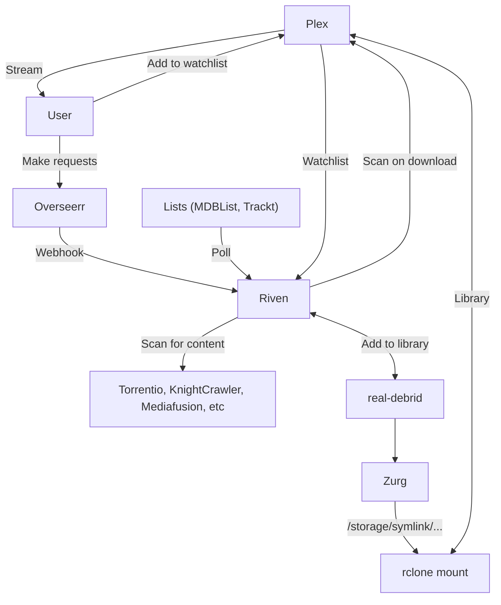

# Optimal "Infinite streaming" from Real-Debrid with Plex and Riven

This page describes a minimal solution to create the optimal "infinite" Plex library, utilizing [Real-Debrid][real-debrid] for all media, streaming through your ElfHosted [Plex][plex] instance.

Here's a video (*privacy mode*) demonstrating demonstrating the whole shebang:

<iframe width="560" height="315" src="https://www.youtube.com/embed/ZHZAEhLuJqk?si=t5HJ5RT8UOfDDuXs" title="YouTube video player" frameborder="0" allow="accelerometer; autoplay; clipboard-write; encrypted-media; gyroscope; picture-in-picture; web-share" referrerpolicy="strict-origin-when-cross-origin" allowfullscreen></iframe>

!!! tip "New accounts get $10 credit, enough to run this stack for a week!"
    Our services are subscribed to in "[ElfBuckz][elfbuckz]", our in-store account credit. All new users get $10 ElfBuckz upon [account creation](https://store.elfhosted.com/my-account/), in order to "kick the tyres" :red_car: before commitment.

The advantages of this solution are:

* No torrent clients, VPNs, ratios or seeding
* No storage constraints, unpacking issues, migrations etc

The disadvantages, of course, are:

* Limited retention - you've only "got" the content as long as your Real-Debrid subscription is current

## Requirements

!!! tip "Riven gets revenue sharing! :heart:"
    Riven is an "Elf-illiated" app - the devs are active in our [Discord][discord] community, the app itself is tuned to work perfectly with ElfHosted "out-of-the-box", and 30% of your subscriptions are contributed to the Riven devs to further development!

* [x] [Real-Debrid account][real-debrid] and [API token](https://real-debrid.com/apitoken)
* [x] ElfHosted's [Infinite Plex / Riven Streaming Starter Kit](https://store.elfhosted.com/product/plex-riven-infinite-streaming-starter-kit)
* [ ] [Overseer](https://store.elfhosted.com/product/overseerr) (*can be substituted with Plex Watchlist/Trakt/MBDLists*)

## How does it work?

Here's a diagram, followed by some explanations:

1. The user adds content to their [Plex][plex] Watchlist, Overseerr, or subscribes to Trakt/MDBLists
2. [Riven][riven] notices the change to the watchlist, searches various indexers for suitable cached torrents on [Real-Debrid][real-debrid], triggers a download. When Riven notices the download, it creates a symlink, and tells Plex to rescan the appropriate Library
3. [Zurg][zurg] + the rclone mount make it appear that the Real-Debrid account is locally mounted to Plex
4. Plex detects the new content, adds it to the library, and it's ready to stream!

## How to set up Riven

Review the [Riven docs][riven] for the next steps!

!!! warning "Beware Real-Debrid IP bans"
    Be aware that Real-Debrid states:
    
    > You can use your account from any public IP address but you can't use your account from more than one public IP address at the same time.

    So if you use RealDebrid **outside** of ElfHosted, it's likely that your account may be warned / banned.

## How do I get help?

1. For general use of the [individual tools](/apps/), refer to the each app's upstream site
2. For specific support re your ElfHosted configuration / account, see the [ElfHosted support options](/get-help)

--8<-- "common-links.md"

