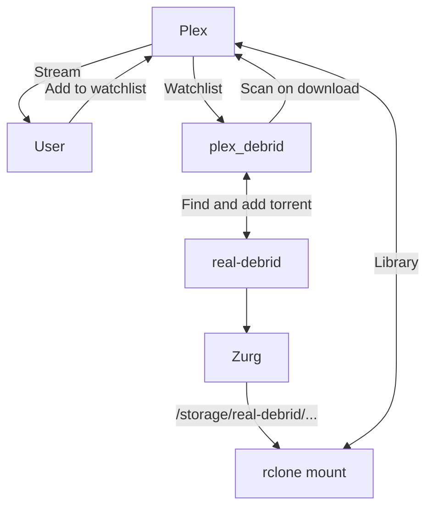

# "Infinite streaming" from Real Debrid with Plex

This page describes a minimal solution to create your "infinite" Plex library, utilizing [Real-Debrid][real-debrid] for all media, streaming through your ElfHosted [Plex][plex] instance.

Here's a video[^1] (*privacy mode*) demonstrating demonstrating the whole shebang:

<iframe width="560" height="315" src="https://www.youtube-nocookie.com/embed/JTFoy0jQS4s?si=I7MW1HlzGa1QWgVd" title="YouTube video player" frameborder="0" allow="accelerometer; autoplay; clipboard-write; encrypted-media; gyroscope; picture-in-picture; web-share" referrerpolicy="strict-origin-when-cross-origin" allowfullscreen></iframe>

!!! tip "New accounts get $10 credit, enough to run this stack for > 10 days!"
    Our services are subscribed to in "[ElfBuckz][elfbuckz]", our in-store account credit. All new users get $10 ElfBuckz upon [account creation](https://store.elfhosted.com/my-account/), in order to "kick the tyres" :red_car: before commitment.

The advantages of this solution are:

* No torrent clients, VPNs, ratios or seeding
* No storage constraints, unpacking issues, migrations etc

The disadvantages, of course, are:

* Limited retention - you've only "got" the content as long as your Real-Debrid subscription is current

## Requirements

* [x] [Real-Debrid account][real-debrid] and [API token](https://real-debrid.com/apitoken)

And from the [ElfHosted store][store]:

* [x] [plex_debrid][plex-debrid]
* [x] [Zurg][zurg]
* [x] [Zurg Rclone Mount](https://store.elfhosted.com/product/rclone-real-debrid/)
* [x] [Plex][plex]

Add the apps above to your cart, or subscribe to all of the above, as a bundle to make it easier, here:

[Get up to 50% off the required apps, conveniently bundled! :gift:](https://store.elfhosted.com/product/minimal-real-debrid-plex-streaming-bundle){ .md-button .md-button--primary }

## How does it work?

Here's a diagram, followed by some explanations:



1. The user adds content to their [Plex][plex] Watchlist
2. [Plex_debrid][plex-debrid] notices the change to the watchlist, searches for suitable cached torrents on [Real-Debrid][real-debrid], triggers a download, and then tells Plex to rescan the appropriate Library
3. [Zurg][zurg] + the rclone mount make it appear that the Real-Debrid account is locally mounted to Plex
4. Plex detects the new content, adds it to the library, and it's ready to stream!

Here's a demo from the plex_debrid repo:

{ loading=lazy }

## How to set it up

Here's a little more detail..

1. Get a [Real-Debrid account][real-debrid] subscription for your ElfHosted account (*can't be used elsewhere at the same time, else you risk being banned*), and copy your [API token](https://real-debrid.com/apitoken)
2. Paste the token into the [Zurg product][store/zurg] on the store, and add to your cart
3. Add at the [Zurg rclone mount][store/zurgmount] and [Plex][store/plex] to your cart, and buy with [ElfBuckz][elfbuckz]!

On purchase, you'll get the necessary components deployed, but some configuration will be required, see below:

### Setup Real-Debrid

To satisfy plex_debrid, ensure that you have at least one file in your RealDebrid library to be detected by Zurg as "movies", and another as "shows". A helpful tool to achieve this is https://debridmediamanager.com, with which you can add [this collection](https://hashlists.debridmediamanager.com/b992bcaf-dab5-42a1-8e17-117904f4ae6b.html) of public domain series/movies.

Confirm Zurg and its folders are setup correctly by browsing it from your ElfHosted dashboard.

### Setup Plex

Claim your Plex instance using [ElfBot][elfbot], and add 2 new media libraries ("movies" and "shows") pointing to `/storage/realdebrid-zurg/[movies/shows]`

### Setup plex_debrid

To avoid unnecessary navigation, and to simplify setup, configure plex_debrid using the `.json` file, as [described in our docs](/app/plex-debrid/#how-do-i-use-it).

### Setup updateplex.sh

To trigger a Plex library update from Zurg when your Real-Debrid content changes, edit `config/zurg/plex_update.sh` via [FileBrowser][filebrowser], find this line:

```
token="yourplextoken"
```

And replace `yourplextoken` with the same plex token you used when configuring plex_debrid.

## Success!

That's it, you're done. Adding content to your Plex watchlist should trigger plex_debrid to find it for you, and once it appears in your real-debrid account, Zurg will make it available to Plex to stream! Hope into our [friendly Discord server][discord] if you have questions or suggestions!

!!! warning "Beware Real-Debrid IP bans"
    Be aware that Real-Debrid states:
    
    > You can use your account from any public IP address but you can't use your account from more than one public IP address at the same time.

    So if you use RealDebrid **outside** of ElfHosted, it's likely that your account may be warned / banned.

## How do I get help?

1. For general use of the [individual tools](/apps/), refer to the each app's upstream site
2. For specific support re your ElfHosted configuration / account, see the [ElfHosted support options](/get-help)

--8<-- "common-links.md"

[^1]: If the YouTube link fails, an alternate copy of the video is available [here](https://video.elfhosted.com/w/5LvkPmHYxBnt8s72mt8Yey) :thumbsup: