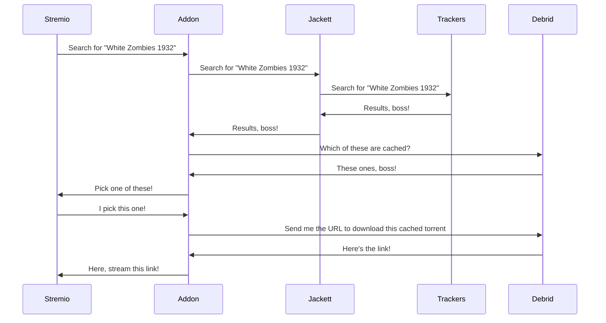

# How to use ElfHosted Stremio Jackett Addon (torrentio alternative)

This guide illustrates how to use the [Stremio-Jackett][stremio-jackett] addon to stream content from debrid providers using [Stremio](https://stremio.com), sourcing content from your **own** torrent indexer ([Jackett][jackett]), rather than relying on the (*often-overloaded*) torrentio addon!

The advantages of this solution are:

* Use the highly-polished, multi-platform Stremio app
* Reduce the impact of Torrentio outages / rate-limits
* Customize your indexer results for your country, language, or even private tracker accounts

The disadvantages, of course, are:

* Limited retention - you've only "got" the content as long as your Debrid subscription is current
* IP restriction - your Debrid provider's regular IP restriction policies apply, so be cautious of streaming from multiple locations simultaneously.
* Jackett's results will appear more slowly in streamio, compared to pre-cached results from other providers

!!! tip
    Consider our [Infinite Streaming Plex](guides/media/stream-from-real-debrid-with-plex/) guide if you'd like to Proxy your Real-Debrid access behind [Zurg][zurg] so that you **can** stream simultaneously from multiple source IPs

## Requirements

* [x] [Real-Debrid][real-debrid] / AllDebrid account (*other providers planned*)

And from the [ElfHosted store][store]:

* [x] [Jackett](https://store.elfhosted.com/product/jackett/)
* [x] [Stremio-jacket](https://store.elfhosted.com/product/stremio-jackett/)

Additionally, if your trackers are behind Cloudflare DDOS protection (*and therefore harder to automatically search*), add [Flaresolverr](https://store.elfhosted.com/product/flaresolverr/).

## How to set it up

### Get the apps

1. [Create an ElfHosted account](https://store.elfhosted.com/my-account)
2. Subscribe to the necessary apps (*above*)
3. Log into your ElfHosted dashboard, at `https://<your username>.elfhosted.com`

### Setup Jackett

Navigate to **Jackett** from your app dashboard (`https://<your username>.elfhosted.com`), add your preferred chosen indexers, and note your Jackett API key

!!! tip "Don't go overboard"
    Every indexer you add slows down your query responses, so prefer to add **small** amounts of **high-quality** indexers

If your indexers require [Flaresolverr][flaresolverr], you can add it to your existing subscription (*But you'll need to do "renew now" to avoid waiting for the 24h renewal cycle*)

Once Flaresolverr is added to your account, configure it in Jackett simply as `http://flaresolverr:8191`

### Setup Stremio-Jackett

Navigate to **Stremio Jackett** from your ElfHosted dashboard, pick your debrid provider, and enter your API key, as well as your Jackett API key:

!!! tip
    It's not necessary to enter a Jackett URL, this is pre-configured for you

### Install the Addon!

Click "**Install**" to allow your OS to open the link in Stremio, or right-click the **Install** button, and copy the long `stremio://` URL, and paste it into your Stremio search bar.



## How does it work?

### Diagram

Here's a diagram, followed by some explanations - assume the user has already configured [Jackett][jackett].

### Explanation

1. The user configures Jackett with their chosen trackers (*usually public*)
2. The user configures Stremio to use the Stremio-Jackett addon
3. When the user searches in Stremio, the addon is queried
4. Stremio-Jackett queries Jackett, which in turn queries its configured trackers, and returns results
5. Stremio-Jackett uses Debrid API key to work out which torrents are already cached on the provider, and returns these to Stremio as options
6. User plays picks an option, the addon gets the download link from the Debrid provider, and sends it to the Stremio to play 

## How do I get help?

1. As highlighted above, stremio-jackett is a very young project under active development. Get in touch in their [Discord server](https://discord.gg/7yZ5PzaPYb), and file issues in their [GitHub repository](https://github.com/aymene69/stremio-jackett/)
2. For specific support re your ElfHosted configuration / account, see the [ElfHosted support options](/get-help/)

--8<-- "common-links.md"

