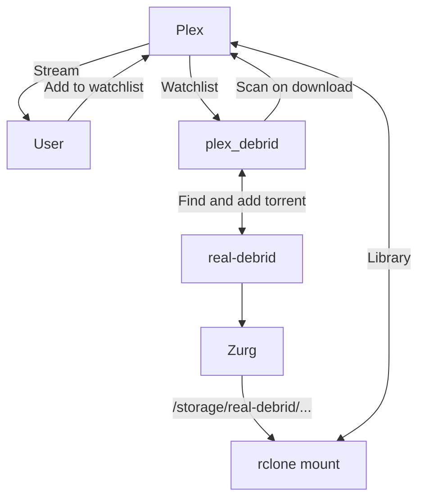
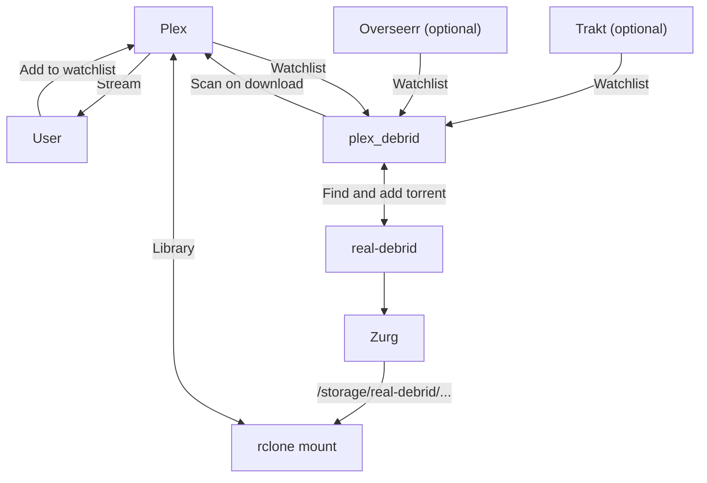
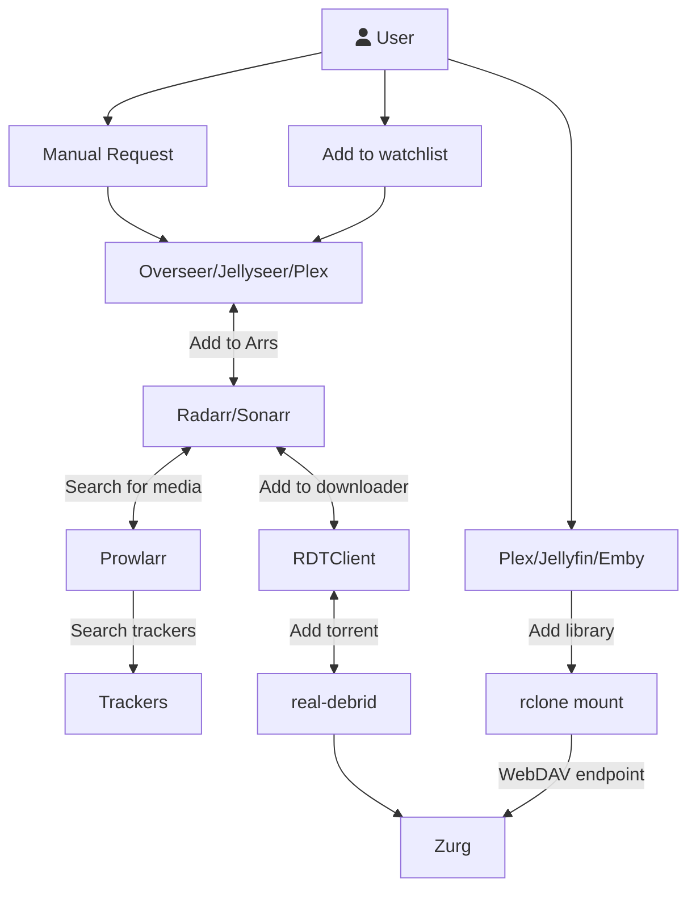

# "Infinite streaming" from Real Debrid with Plex

This page describes a minimal solution to create your "infinite" Plex library, utilizing [Real-Debrid][real-debrid] for all media, streaming through your ElfHosted Plex instance.

## Requirements

* [x] [Real-Debrid account][real-debrid] and [API token](https://real-debrid.com/apitoken)
* [x] [plex_debrid][plex-debrid]
* [x] [Zurg][zurg]
* [x] [Zurg Rclone Mount](https://store.elfhosted.com/product/rclone-real-debrid/)
* [x] [Plex][plex

## How does it work?

Here's a diagram, followed by some explanations:

1. The user adds content to his Plex Watchlist
2. Plex_debrid notices the change to the watchlist, searches for suitable cached torrents on Real-Debrid, triggers a download, and then tells Plex to rescan the appropriate Library
3. Zurg + the rclone mount make it appear that the Real-Debrid account is locally mounted to Plex - Plex detects the new content, adds it to the library, and it's ready to stream!

Here's a demo from the plex_debrid repo:

{ loading=lazy }

## How to set it up

## Lightweight debrid setup

## The classic Arr setup

### Create account, get $10 free credit

[Sign up for an account](https://store.elfhosted.com/my-account/), and confirm your $10 [ElfBuckz][elfbuckz] (*store credit*) balance.

### Add Plex with VPN

[Subscribe][store/plex] to Plex using your chosen VPN provider, and claim your new [Plex][plex] instance using [ElfBot][elfbot].

Your Plex Cloud URL will be `https://<your username>-plex.elfhosted.com`.

### Attach cloud storage to Plex

You get 100GB free "[ElfStorage][elfstorage]", but this won't be enough for any sort of media collection (*other than perhaps [books][calibre-web]!*) Pick one (*or more*) of the options below:

1. Add more [ElfStorage][elfstorage] at $0.20/TB/day (*so $6/TB*)
2. [Buy a storagebox][storagebox] from Hetzner (*sized at 1TB, 5TB, 10TB, and 20TB*)
3. [Mount][store/storage] your existing (*rclone-compatible*) cloud storage

### Populate your Plex Cloud

If you're using ElfStorage or a Storagebox, import any media you'd like per the [migration instructions](/how-to/migrate/).

If you're attaching existing cloud storage, setup your Plex libraries to point to the correct location in `/storage/`.

### Enjoy your own Plex Cloud!

That's it! Enjoy using your new Plex Cloud to stream your media to yourself and your friends and family, without the hassle of local hosting or storage management!

## Why not just self-host Plex?

[Self-hosting](https://reddit.com/r/selfhosted) is a fun and rewarding way to have complete control over your applications and content. If you're into self-hosting, check out [Funky Penguin's Geek Cookbook](https://geek-cookbook.funkypenguin.co.nz), specifically the [Plex](https://geek-cookbook.funkypenguin.co.nz/recipes/plex/) stack.

Reasons **not** to self-host Plex may include:

* [x] You want to avoid the hardware / power costs involved
* [x] You want more reliability / uptime for your Plex server, while your self-hosting / homelab is for tinkering
* [x] You want media streaming to **just work** (*we manage app updates, hardware, connectivity, security, etc.*)

## What now?

That's it, you're done. Hope into our [friendly Discord server][discord] if you have questions or suggestions!

--8<-- "common-links.md"