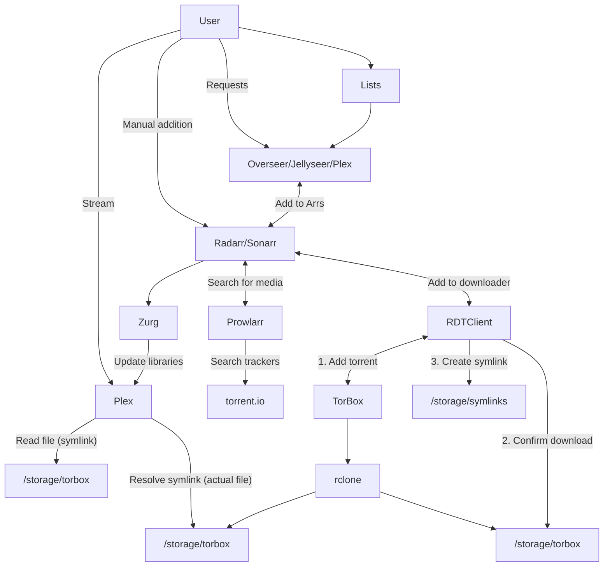

# "Infinite streaming" from TorBox with Plex, Prowlarr, Radarr, and Sonarr

This page describes a more complex, flexible version of our [plex_debrid-based, minimal solution](/guides/media/stream-from-real-debrid-with-plex/) to create your "infinite" Plex library, utilizing [TorBox][torbox] for all media, streaming through your ElfHosted Plex instance.

The solution leverages the popular Arr tools to search, source, and sort your media, stealthily using symlinks to skip storage stresses!

## Requirements

* [x] [TorBox account][torbox] and [API token](https://torbox.app/settings)
* [x] ElfHosted's ["Hobbit" Infinite Arr Streaming bundle](https://store.elfhosted.com/product/hobbit-plex-arrs-real-debrid-infinite-streaming-bundle)

## How does it work?

Here's a diagram (*it's not as complicated as it looks!*), followed by some explanations:

1. The user adds content to their [Plex][plex] Watchlist, or [Overseerr][overseerr] / [Jellyseerr][jellyseerr]/ [Ombi][ombi] requests
2. Radarr / Sonarr notice the the new addition, and search Prowlarr (*torrentio indexer*) for appropriate files (*matching size, quality, language parameters*)
3. When an appropriate release is found, Radarr / Sonarr schedules a download via RDTClient, which is presenting a qBittorrent-like API
4. RDTClient adds the torrent to the user's TorBox library, and then monitors the rclone mount path (`/storage/torbox`) to confirm the download has succeeded. Upon success, RDTClient **symlinks** the download to Radarr/Sonarr's `completed` directory, and they process is as if it were a local download (*renaming and moving to the media path*)
5. Aars trigger autoscan, which in turn triggers Plex to re-scan the media path containing the new content, and the Plex library is updated!

## How to set it up

Here's a little more detail..

1. Purchase a subscription to the TorBox ["Hobbit" Infinite Arr Streaming bundle](https://store.elfhosted.com/product/hobbit-plex-arrs-torbox-infinite-streaming-bundle)
2. Get a [TorBox account][torbox] account, and copy your [API token](https://torbox.app/settings)
3. Log into your ElfHosted dashboard (`https://<your username>.elfhosted.com`), and navigate to **Tools** -> **Filebrowser**. Within FileBrowser, use [ElfBot][elfbot] to set your TorBox username and password

### Setup Plex

Claim your Plex instance using [ElfBot][elfbot], and add media libraries in `/storage/symlinks/{movies,series,movies-4k,series-4k, etc}`.

### Setup RDTClient

Configure [RDTClient], by pasting TorBox API key into the config section (*the rest is pre-configured*).

### Setup Prowlarr

Navigate to Prowlarr, and configure the TorBox indexer (*search "torbox"*). In the properties of the indexer, set your `Real-Debrid API Key`, test, and save.

Run `Sync App Indexers` to add the indexers (*via Prowlarr*) to Radarr and Sonarr.

### Setup Radarr / Sonarr

Configure your **Root Folders** to `/storage/symlinks/<whatever>`, since this is where the symlinks will appear. You do **not** need `/storage/torbox` (*in fact, its read-only nature will just confuse the Arr!*)

## Success!

That's it! You've got the basic plumbing in place for "unlimited storage" from TorBox, managed by the Arrs and streamed by Plex!
    
## How do I get help?

1. For general use of the [individual tools](/apps/), refer to the each app's upstream site
2. For specific support re your ElfHosted configuration / account, either post a topic in the [#elf-forum](https://discord.com/channels/396055506072109067/1119489053927145472) channel, or call for 1:1 [#elf-help](https://discord.com/channels/396055506072109067/1119478614287712337).

--8<-- "common-links.md"

